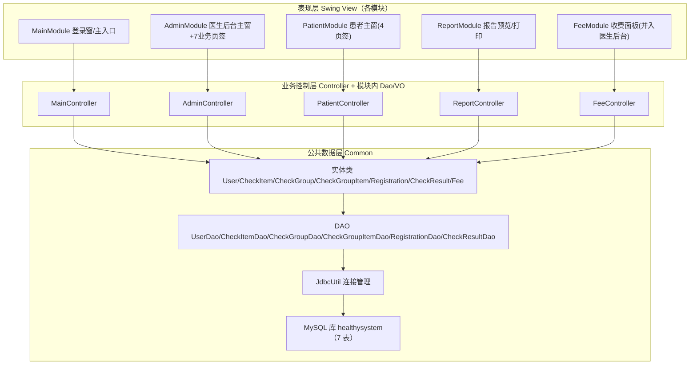
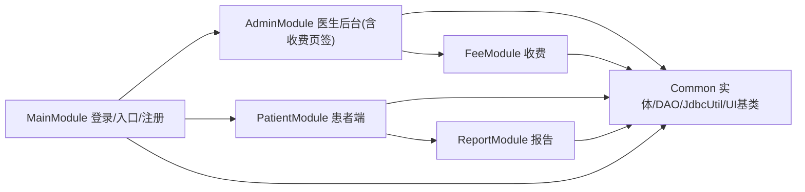
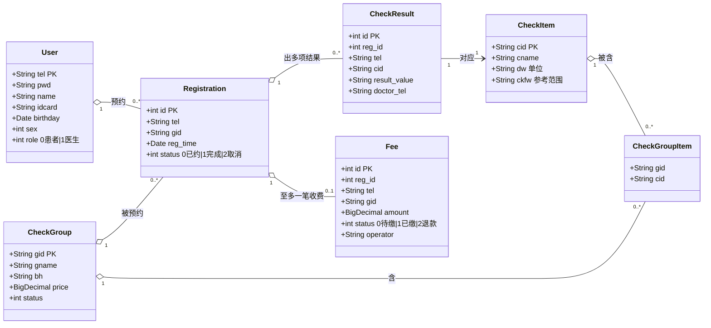
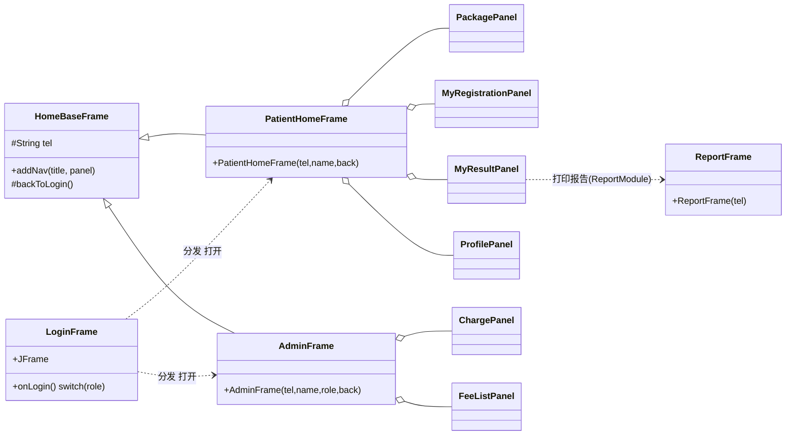
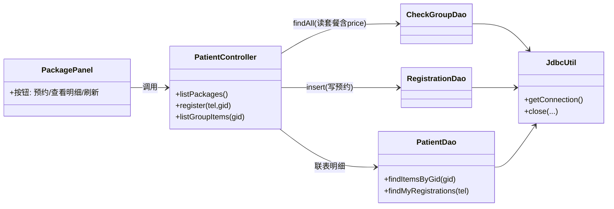
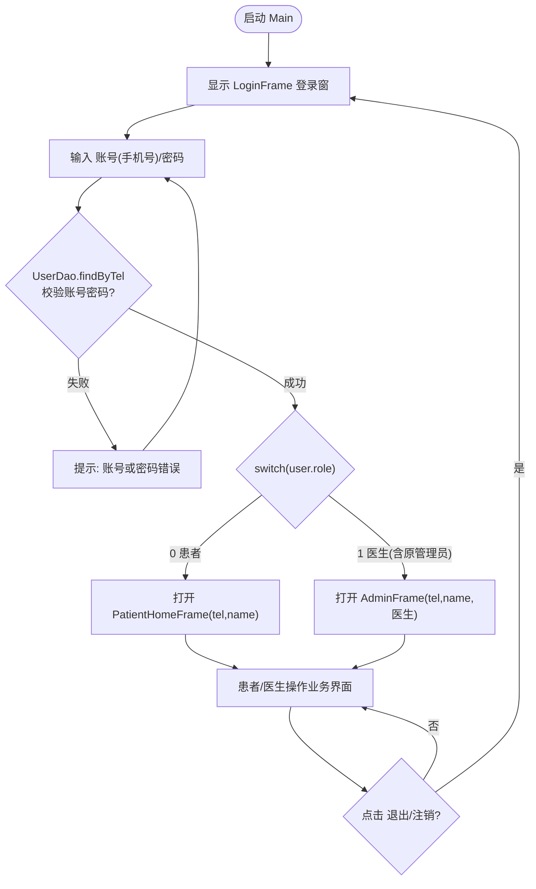
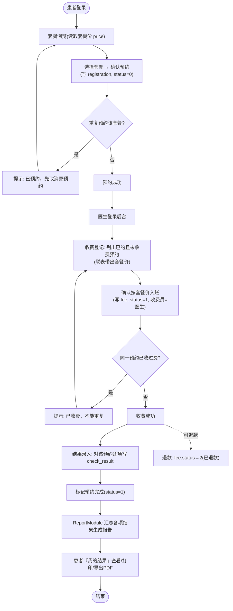

# 二、系统分析与设计

> 本文档基于仓库实际代码撰写。文中 Mermaid 图（类图 / 功能模块图 / 程序流程图）可直接渲染：
> - 用 **Typora / GitHub / VS Code(Mermaid 插件)** 打开本文件即可看到图；
> - 或把每一段 ```mermaid ``` 代码复制到 **https://mermaid.live** 导出 PNG/SVG 放进 Word 报告。

---

## 2.1 分析与设计总体思路

系统采用**自底向上的三层体系**：自下而上依次是——

1. **数据层**（Common + MySQL）：把现实业务对象落成 7 张表和统一的实体类、DAO，是全系统唯一的数据出入口；
2. **业务控制层**（各模块 Controller/Dao/VO）：把界面动作整理成业务方法（预约、收费入账、出报告等），处理规则与边界；
3. **表现层**（各模块 View/Swing）：面向患者的操作界面，不直接写 SQL，只调控制层。

并在此之上按**“角色视角 + 复用视角”**拆成 6 个 Maven 模块（Main / Admin / Patient / Report / Fee / Common），做到“界面按角色分、逻辑按复用收”。



## 2.2 需解决的关键技术问题

| 编号 | 关键技术问题 | 本项目中的解决方案 |
|:--|:--|:--|
| 1 | **多角色统一登录与主窗分发**：患者、医生（含原管理员）多类使用者，若各自建登录会重复且难维护 | 两类角色收敛进同一张 `users` 表，用 `role`（0患者/1医生）区分；只保留 **MainModule 一个登录入口**（`LoginFrame`），登录成功 `switch(role)` 分发到 `PatientHomeFrame` 或 `AdminFrame`，新增角色只需改一处分发代码 |
| 2 | **多人并行开发的耦合与冲突**：一个公共数据层被多人读写，改公共类易冲突 | 建立 `Common` 模块放实体与通用 DAO；各业务模块自带私有 Dao/VO（`AdminDao`/`PatientDao`/`FeeDao`），约定“改/加自己模块的 Dao，尽量不动 Common”；真实数据库密码走 `.gitignore` 忽略的 `db-local.properties` |
| 3 | **“套餐-检查项”多对多、预约-结果-收费多张表的关联建模** | 用中间表 `checkgroup_item` 表达套餐与检查项的多对多；`registration` 按套餐记一次预约，`check_result` 按预约记多条结果，`fee` 按预约记一条收费 |
| 4 | **收费业务正确性**：防止重复收费、金额口径不一致 | 用 `FeeDao.findByRegId` 判重（一预约至多一条 fee）；`hasActiveRegistration` 防患者重复预约；金额不手输，联表直读套餐 `checkgroup.price` 入账并处理“套餐未定价”边界 |
| 5 | **JDBC 连接与异常管理**：直连 JDBC 资源易泄漏、异常易崩界面 | `JdbcUtil` 统一 `getConnection/close`；每个 DAO 用 try-catch-finally 保证关闭；界面层捕获业务返回值并弹窗提示，不让 SQLException 崩掉 Swing 界面 |
| 6 | **中文打印与 PDF 导出**：Swing 打印和 PDF 常见中文乱码/缺字体 | 报告打印用 `java.awt.print`；PDF 用 OpenPDF 内置 `STSong-Light` CID 字体，无需随包携带字体文件 |
| 7 | **多窗口 UI 风格统一**：六个模块各自写界面易风格杂乱 | Common 提供 `Ui`/`UiTheme`（表格、按钮、卡片、配色等工厂）和 `HomeBaseFrame`（侧边导航主窗基类），`AdminFrame`/`PatientHomeFrame` 均继承 `HomeBaseFrame` 后 `addNav(...)` 追加页签 |
| 8 | **跨模块“报告/收费被别的端复用”**：患者要看报告、后台要收费，二者作为独立模块又会被依赖 | ReportModule 提供 `ReportFrame(tel)`，被患者端“我的结果→打印报告”打开；FeeModule 的 `ChargePanel/FeeListPanel` 被 `AdminFrame` 以页签形式加入，依赖单向无环 |

## 2.3 从现实世界提取对象

体检中心业务中的现实事物可归纳为以下**业务对象**：

| 现实对象 | 抽象对象 | 关键属性 | 与其它对象的关系 |
|:--|:--|:--|:--|
| 患者 / 医生 | `User`（一张表 role 区分） | 账号(手机号)、姓名、密码、身份证、生日、性别、role | 患者拥有多次预约 |
| 单个体检项目 | `CheckItem`（检查项，如空腹血糖） | 编号、名称、单位、参考范围、状态 | 可属于多个套餐 |
| 一份体检套餐 | `CheckGroup`（检查组/套餐） | 编号、名称、备注、**套餐价 price**、状态 | 包含多个检查项；被多次预约 |
| 套餐与检查项的“包含”关系 | `CheckGroupItem`（中间表） | — | 把 CheckGroup 与 CheckItem 关联起来 |
| 患者对套餐的一次预约 | `Registration` | 患者、套餐、预约时间、状态(0已约/1完成/2取消) | 属于某患者、针对某套餐；产生多条结果；最多一条收费 |
| 一次预约里各项的检测值 | `CheckResult` | 所属预约、患者、检查项、结果值、录入医生、时间 | 从属于一次预约和一个检查项 |
| 对一次预约的收费 | `Fee` | 所属预约、患者、套餐、金额、状态(0待缴/1已缴/2退款)、收费员、时间 | 从属于一次预约 |

它们之间的关联在数据库中即为 7 张表的外键关系（详见 2.6 的 ER 化映射）。

## 2.4 功能耦合分析与模块拆分

**拆分依据有两条**：

1. **按角色拆表现层**：患者与医生（后台）交互差别大，故 `PatientModule`、`AdminModule` 分开，各自只向本角色开放功能。
2. **按复用抽公共与“能力中心”**：实体/DAO 被所有人用 → 抽 `Common`；出报告与收费是被别人调用的**能力** → 拆成独立 `ReportModule`、`FeeModule`，谁需要谁依赖。

由此得到**单向、无环**的依赖：



- `Common` 被全部依赖（最底层）；
- `ReportModule` 只被患者端依赖（打印报告入口在“我的结果”）；
- `FeeModule` 只被 `AdminModule` 依赖（收费面板并入医生后台页签，收费员=登录医生）；
- `MainModule` 只依赖各主窗所在的 `AdminModule/PatientModule`，负责把登录后的用户按 role 送进对应主窗。

这样每个模块的职责单一、改动的影响面被限制在模块内，符合高内聚低耦合。

## 2.5 功能归属（哪些功能归哪些对象/类）

每个业务模块内部统一按 **View（接收事件）→ Controller（组织业务）→ Dao/VO（SQL/对象）** 组织，功能归属如下：

| 功能 | 归属（表现层） | 归属（控制/数据层） |
|:--|:--|:--|
| 账号密码登录、角色分发、患者自助注册 | `LoginFrame` / `RegisterDialog`（Main） | `MainController` → `UserDao.findByTel/insert` |
| 维护检查项（增删改、上/下架） | `CheckItemPanel`（Admin） | `AdminController` → `CheckItemDao` |
| 维护套餐及其与检查项关联 | `CheckGroupPanel`（Admin） | `AdminController` → `CheckGroupDao`/`CheckGroupItemDao` |
| 用户管理 | `UserPanel`（Admin） | `AdminController` → `UserDao` |
| 预约管理（含日历查看） | `RegistrationPanel`/`CalendarPanel`（Admin） | `AdminController` → `RegistrationDao` |
| 结果录入 | `CheckResultPanel`（Admin） | `AdminController` → `CheckResultDao` |
| 患者浏览套餐、查看明细、预约/取消 | `PackagePanel` / `MyRegistrationPanel`（Patient） | `PatientController` → `CheckGroupDao`/`RegistrationDao`/`PatientDao` |
| 患者查看本人结果 | `MyResultPanel`（Patient） | `PatientController` → `PatientDao.findResultsByRegId` |
| 患者个人资料 | `ProfilePanel`（Patient） | `PatientController` → `UserDao` |
| 收费登记（按套餐价入账） | `ChargePanel`（Fee，并入 Admin） | `FeeController` → `FeeDao.findUnchargedRegs/insert` |
| 收费记录 / 退款 | `FeeListPanel`（Fee，并入 Admin） | `FeeController` → `FeeDao.findAllFees/updateStatus` |
| 报告预览、打印、导出 PDF | `ReportFrame` / `ReportPrintable`（Report） | `ReportController` → `ReportDao` → `PdfReportExporter` |

## 2.6 对象抽象为类（表 → 实体 → DAO 映射）

“对象抽象为类”在本系统体现为两层映射：

**① 数据库表 ↔ 实体类 ↔ DAO（数据层抽象）**

| 表 | 实体（Common.model） | DAO（Common.dao） | 主要使用端 |
|:--|:--|:--|:--|
| users | `User` | `UserDao` | 登录/资料/用户管理 |
| checkitem | `CheckItem` | `CheckItemDao` | 检查项管理/套餐明细 |
| checkgroup | `CheckGroup` | `CheckGroupDao` | 套餐管理/患者浏览(含价) |
| checkgroup_item | `CheckGroupItem` | `CheckGroupItemDao` | 套餐-检查项关联 |
| registration | `Registration` | `RegistrationDao` | 预约/预约管理 |
| check_result | `CheckResult` | `CheckResultDao` | 结果录入/报告数据 |
| fee | `Fee` | FeeModule 内 `FeeDao` | 收费 |

每个实体类的**字段与表列一一对应**，DAO 提供 `insert/findAll/findByX/update/delete` 并统一用 `JdbcUtil` 拿连接、`try-finally` 关闭。

**② 现实“人/操作”抽象为窗口类（表现层抽象）**
- 每个角色一扇主窗：`PatientHomeFrame`、`AdminFrame`（都继承 `HomeBaseFrame`，获得统一侧边导航 + 退出登录回调）；
- 每块业务一块页签面板：如套餐浏览 `PackagePanel`、收费登记 `ChargePanel`；
- 弹窗类对话框（注册、套餐明细、报告）独立成 `RegisterDialog`、`JOptionPane`、`ReportFrame` 等。

## 2.7 类图（含关系）

### 2.7.1 领域模型类图（核心业务对象及其关系）



### 2.7.2 登录分发与各主窗组装（表现层结构类图）



### 2.7.3 各模块“View→Controller→Dao→DB”调用链（以患者预约为例）



> 其余模块（收费、报告、后台）均遵循同一 `Panel → Controller → Dao → JdbcUtil` 模板，故不再逐一展开。

## 2.8 功能模块图

```mermaid
flowchart TD
    Sys["健康管理系统"]
    Sys --> Login["登录与注册(MainModule)<br/>账号密码登录·患者自助注册·按角色分发"]
    Login -->|role=0| P
    Login -->|role=1| A
    A["医生后台 AdminModule"]
    A --> A1["检查项管理"]
    A --> A2["套餐管理(含关联)"]
    A --> A3["用户管理"]
    A --> A4["预约管理"]
    A --> A5["结果录入"]
    A --> A6["收费登记(Fee)"]
    A --> A7["收费记录/退款(Fee)"]
    P["患者端 PatientModule"]
    P --> P1["套餐浏览(含费用)"]
    P --> P2["我的预约(预约/取消)"]
    P --> P3["我的结果"]
    P --> P4["个人资料"]
    P --> P5["报告打印/PDF(Report)"]
    Rep["报告模块 ReportModule"]
    P5 --> Rep
    Rep --> R1["报告预览"]
    Rep --> R2["打印 java.awt.print"]
    Rep --> R3["导出PDF OpenPDF"]
    C["公共层 Common：实体/DAO/JdbcUtil/UI","DB:7张表"]
    A -.读写.-> C
    P -.读写.-> C
    Login -.读写.-> C
```

## 2.9 程序流程图

### 2.9.1 登录与角色分发流程



### 2.9.2 核心业务链路：预约 → 收费 → 录入结果 → 出报告



---

> 说明：2.9.2 中“收费登记”目前实现为按套餐价直接入账（`fee.status` 置 1），退款单独置 2；“待缴(0)”状态为表结构预留。若后续按实训要求扩展（患者查看缴费、收费统计等），可在此基础上增量补充。
